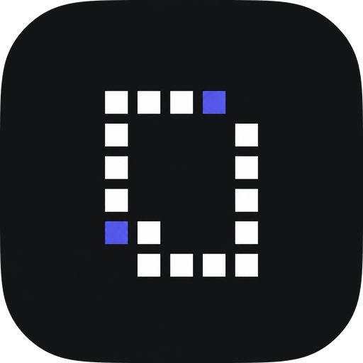

<div align="center">



# CompanyOS

**Jira for your agents.**

An agent-native work platform. Your agents run boards, tasks, sprints, meetings, and notes
alongside your team, over a built-in MCP server, on your own keys.

[](LICENSE)
[](https://github.com/woosal1337/companyos/releases)
[](https://github.com/woosal1337/companyos/actions/workflows/ci.yml)
[](https://github.com/woosal1337/companyos/stargazers)
[](https://github.com/woosal1337?tab=packages)
[](https://docs.company.chele.bi)

[Quick start](#quick-start) · [Docs](https://docs.company.chele.bi) · [Features](#features) · [Architecture](#architecture) · [Self-hosting](#self-hosting) · [Development](#development)

</div>

---

## Why CompanyOS

Most teams now run on two kinds of labor, people and agents, scattered across a dozen
disconnected tools. CompanyOS gives both one place to work. It is a single, multi-tenant,
agent-native platform where **projects, tasks, sprints, meetings, notes, and the agents
and people doing the work live together**, so every task traces back to the conversation
that created it.

A built-in **MCP server** exposes the whole workspace to your agents over OAuth, the
in-product assistant and AI agents run on **your own keys (BYOK)**, and the whole thing is
**open source and self-hostable**, so your data stays on your infrastructure.

## Features

**Plan & track**
- Projects with leads, members, states, and templates
- Tasks with List, Board (Kanban), and Table views, sub-tasks, labels, priorities, and a query language (PQL)
- Cycles (sprints), Initiatives, Milestones, and Releases for planning at every altitude
- Intake & triage — turn inbound requests and forms into tracked work

**Meetings & knowledge**
- Speaker-attributed meeting transcripts, AI summaries, and "ask the meeting"
- Notes, wiki, and docs with **live, multi-cursor co-editing** (Yjs)
- Retrospectives and reusable meeting templates

**AI & MCP**
- In-product AI assistant over your company brain — **bring your own key** (per-org)
- AI agents with budgets, automations, and a sandboxed runner
- A built-in **MCP server** exposing the whole workspace to agents over OAuth, plus connectors and a marketplace

**Collaboration**
- Threaded comments, reactions, and resolve across every entity
- Activity feeds, notifications, full-text search, favorites, and stickies
- Public embeds and shareable links

**Enterprise & platform**
- True multi-tenancy with org-scoped data isolation
- SSO (SAML / OIDC), SCIM, LDAP, IdP group sync, and domain verification
- Role-based access control with audit logs, approvals, and compliance surfaces
- Webhooks, an outbox/event backbone, S3-compatible object storage, and analytics dashboards

## Quick start

Run the whole stack — Postgres, the API, and the web app — with one command.
Requires [Docker](https://docs.docker.com/get-docker/) with the Compose plugin.

```bash
git clone https://github.com/woosal1337/companyos.git
cd companyos
cp .env.example .env
docker compose up --build
```

Then open **http://localhost:3000**. The API is on **http://localhost:8000**
(health at `/api/v1/health`), and database migrations run automatically on start.

Full documentation, guides, and the company-brain MCP reference live at
**[docs.company.chele.bi](https://docs.company.chele.bi)**.

The `.env.example` defaults are for **local evaluation only**. For a real
deployment, generate fresh secrets and switch to production mode:

```bash
# in .env
COMPANYOS_KEK=$(python3 -c "import base64,os;print(base64.urlsafe_b64encode(os.urandom(32)).decode())")
JWT_SECRET_KEY=$(openssl rand -hex 32)
ENV=production            # secure cookies — serve the web app over HTTPS
```

In `production` mode the API refuses to start unless `COMPANYOS_KEK` and
`JWT_SECRET_KEY` are set to strong, non-default values.

## Architecture

CompanyOS is a monorepo with two deployable services and one database.

```
            ┌──────────────┐        ┌──────────────┐        ┌──────────────┐
  browser → │   web (3000) │  /api  │   api (8000) │  SQL   │  PostgreSQL  │
            │   Next.js    │ ─────► │   FastAPI    │ ─────► │              │
            └──────────────┘        └──────────────┘        └──────────────┘
```

```
companyos/
├── apps/
│   ├── api/   FastAPI · SQLAlchemy · Alembic · Postgres   (the backend)
│   └── web/   Next.js · Turborepo · Tailwind              (the web UI)
├── docker-compose.yml    one-command full stack
└── .env.example
```

- **Backend** — Python / FastAPI, async SQLAlchemy, Alembic migrations, an in-process
  realtime relay for co-editing, and an MCP server. Runs as a single container; its
  only dependency is Postgres.
- **Web** — Next.js (standalone output) talking to the API through a same-origin
  `/api` proxy. Deployable as a container or on any Next.js host.

## Self-hosting

The Docker Compose path above is the fastest way to run CompanyOS. For Kubernetes
(Helm or raw manifests), Docker Swarm, and a full configuration reference, see
**[`apps/api/SELF-HOSTING.md`](apps/api/SELF-HOSTING.md)** and `apps/api/deploy/`.

Tagged releases publish container images to GHCR:
`ghcr.io/woosal1337/companyos-api` and `ghcr.io/woosal1337/companyos-web`.

## Development

Each app can be run and developed on its own:

- **Backend** — [`apps/api`](apps/api) (uv, ruff, mypy, pytest; `uv run uvicorn companyos.main:app`)
- **Web** — [`apps/web`](apps/web) (Bun, Turborepo; `bun run dev`)

See each app's `README.md` and `CONVENTIONS.md` for the project rules. The web app
talks to the API via the `BACKEND_ORIGIN` build argument.

## Mobile

A companion mobile app (React Native / Expo) lives in a separate repository.

## Contributing

Contributions are welcome. See [`CONTRIBUTING.md`](CONTRIBUTING.md) for how to run
the project and the checks a PR needs to pass, plus the conventions in
[`apps/api/CONVENTIONS.md`](apps/api/CONVENTIONS.md) and
[`apps/web/CONVENTIONS.md`](apps/web/CONVENTIONS.md). To report a vulnerability, see
[`SECURITY.md`](SECURITY.md).

## License

Licensed under the [Apache License 2.0](LICENSE).
